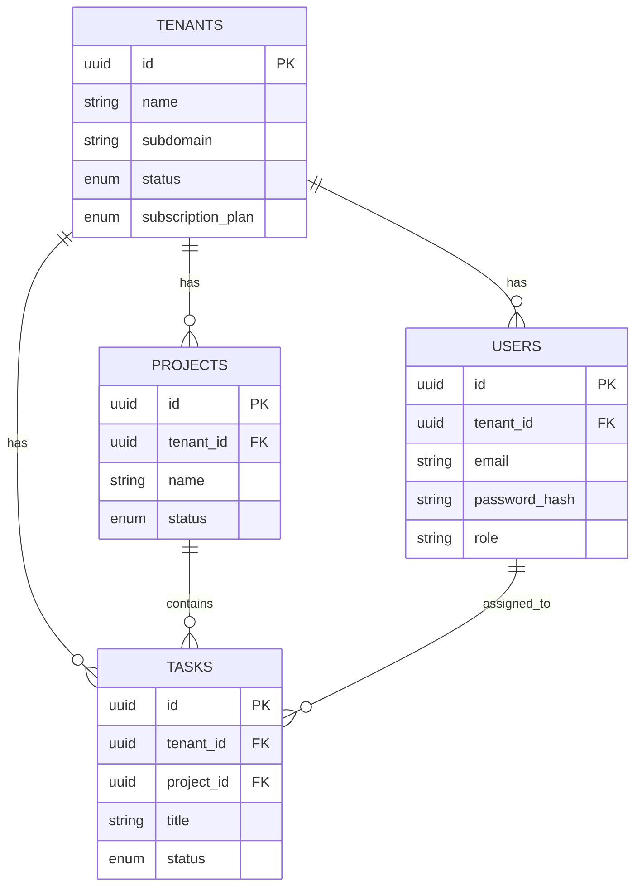

# System Architecture Design

## 1. System Architecture Diagram

```mermaid
graph TD
    Client[Client Browser] -->|HTTP/REST| Frontend[Frontend (React/Vite)]
    Frontend -->|HTTP/REST| Backend[Backend (Node.js/Express)]
    Backend -->|SQL| Database[(PostgreSQL)]
    
    subgraph Docker Network
        Backend
        Database
        Frontend
    end

    classDef container fill:#e1f5fe,stroke:#01579b,stroke-width:2px;
    class Backend,Database,Frontend container;
```

*(Note: See below for the visual representation)*


## 2. Database Schema Design (ERD)

The database uses a **Shared Schema** approach. All tables (except strict system tables if any) have a `tenant_id` foreign key.



### Core Tables & Relationships
1.  **Tenants:** root entity.
2.  **Users:** Belong to a tenant. `tenant_id` FK. Unique email per tenant.
3.  **Projects:** Belong to a tenant. `tenant_id` FK.
4.  **Tasks:** Belong to a project AND a tenant (denormalized `tenant_id` for easier queries/isolation).
5.  **Audit Logs:** Record actions.

## 3. API Architecture

### Authentication
*   `POST /api/auth/register-tenant` - Register new organization
*   `POST /api/auth/login` - Login user
*   `GET /api/auth/me` - Get current user profile
*   `POST /api/auth/logout` - Logout

### Tenant Management
*   `GET /api/tenants` - List all tenants (Super Admin only)
*   `GET /api/tenants/:tenantId` - Get details
*   `PUT /api/tenants/:tenantId` - Update details

### User Management
*   `GET /api/tenants/:tenantId/users` - List users
*   `POST /api/tenants/:tenantId/users` - Add user
*   `PUT /api/users/:userId` - Update user
*   `DELETE /api/users/:userId` - Delete user

### Project Management
*   `GET /api/projects` - List projects
*   `POST /api/projects` - Create project
*   `PUT /api/projects/:projectId` - Update project
*   `DELETE /api/projects/:projectId` - Delete project

### Task Management
*   `GET /api/projects/:projectId/tasks` - List tasks
*   `POST /api/projects/:projectId/tasks` - Create task
*   `PUT /api/tasks/:taskId` - Update task
*   `PATCH /api/tasks/:taskId/status` - Quick status update
