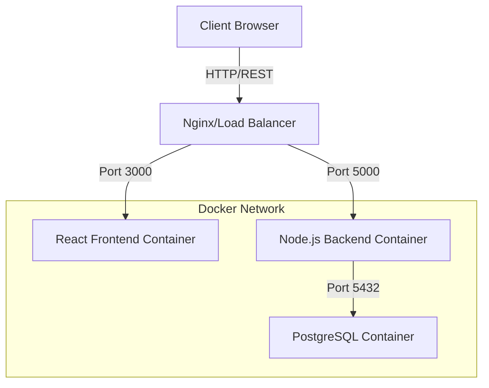
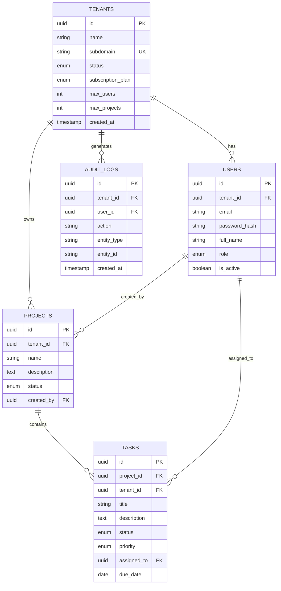

# System Architecture

## 1. High-Level Architecture

The system follows a typical 3-tier architecture containerized with Docker.

## 2. Database Schema (ERD)

## 3. API Architecture

### Authentication
- `POST /api/auth/register-tenant` (Public)
- `POST /api/auth/login` (Public)
- `GET /api/auth/me` (Auth Required)
- `POST /api/auth/logout` (Auth Required)

### Tenant Management
- `GET /api/tenants` (Super Admin)
- `GET /api/tenants/:tenantId` (Auth Required)
- `PUT /api/tenants/:tenantId` (Admin/Super Admin)

### User Management
- `POST /api/tenants/:tenantId/users` (Tenant Admin)
- `GET /api/tenants/:tenantId/users` (Auth Required)
- `PUT /api/users/:userId` (Tenant Admin/Self)
- `DELETE /api/users/:userId` (Tenant Admin)

### Project Management
- `POST /api/projects` (Auth Required)
- `GET /api/projects` (Auth Required)
- `PUT /api/projects/:projectId` (Auth Required)
- `DELETE /api/projects/:projectId` (Auth Required)

### Task Management
- `POST /api/projects/:projectId/tasks` (Auth Required)
- `GET /api/projects/:projectId/tasks` (Auth Required)
- `GET /api/tasks/:taskId` (Auth Required)
- `PUT /api/tasks/:taskId` (Auth Required)
- `PATCH /api/tasks/:taskId/status` (Auth Required)
- `DELETE /api/tasks/:taskId` (Auth Required)

### System
- `GET /api/health` (Public)
